# Market System Architecture

[中文版本](architecture-market-system.zh-CN.md) | [English Version](architecture-market-system.md)

This document describes the functional architecture of the complete Market application composed of the Market project and the Dynamic Chart Repository project.

## System Architecture Overview

The Market system consists of two core projects:
- **Market Project**: Core app store service responsible for application information management, task processing, and API services
- **Dynamic Chart Repository Project**: Helm Chart dynamic repository responsible for Chart rendering, image analysis, and status management

## Interaction Between the Two Projects

### 1 Application Rendering Functionality

### 2 Data Synchronization Functionality

### 3 Configuration Management Functionality

### 4 Status Monitoring Functionality

## Data Flow

**Color Legend:**
- 🔵 **Blue**: Steps executed by the Market project (including Market's Redis storage)
- 🔴 **Pink**: Steps executed by the Chart Repo project (including Chart Repo's Redis storage)
- 🟡 **Yellow**: Cross-project interactions (API calls)

```mermaid
flowchart TD
    subgraph "Market Project Data Flow"
        SyncerStart[Syncer Scheduled Sync<br/>Fetch Data from Remote API]
        DataParse[Application Data Parsing]
        AdminFetch[Admin Configuration Fetch]
        DataMerge[Data Merging]
        CacheUpdate[(Update In-Memory Cache)]
        RedisPersist[(Write to Redis)]
    end

    subgraph "Market to Chart Repo Data Flow"
        SyncRequest[Synchronization Request<br/>POST /dcr/sync-app]
        PendingQueue[Pending Queue<br/>AppInfoLatestPending]
    end

    subgraph "Chart Repo Processing Flow"
        HydratorStart[Hydrator Start Processing<br/>Fetch Tasks from Pending Queue]
        
        subgraph "5-Step Processing Flow"
            S1[1. SourceChartStep<br/>Source Chart Processing<br/>• Verify if source Chart package exists<br/>• Fetch Chart from remote or local<br/>• Extract and verify Chart structure]
            S2[2. RenderedChartStep<br/>Chart Rendering<br/>• Render Chart template using Helm<br/>• Apply values.yaml parameters<br/>• Generate rendered Chart package]
            S3[3. CustomParamsUpdateStep<br/>Custom Parameters Update<br/>• Update custom parameters in Chart<br/>• Handle user custom configurations<br/>• Merge parameters into values.yaml]
            S4[4. ImageAnalysisStep<br/>Image Analysis<br/>• Scan Docker images in Chart<br/>• Extract image names and tags<br/>• Analyze image architecture and size<br/>• Generate image information cache]
            S5[5. DatabaseUpdateStep<br/>Database Update<br/>• Update in-memory cache CacheManager<br/>• Persist to Redis storage<br/>• Change status from Pending to Latest<br/>• Store Chart files to file system]
        end

        Success[Success<br/>AppInfoLatest<br/>Application Data Available]
        Failed[Failed<br/>AppRenderFailed<br/>Record Error Information]
    end

    subgraph "Status Synchronization Flow"
        StateChange[Chart Repo Generates Status Change Events<br/>app_upload_completed / image_info_updated]
        StateHistory[(Status History Storage<br/>Redis)]
        MarketPoll[Market DataWatcherRepo<br/>Poll /state-changes<br/>Every 2 minutes]
        FetchDetail[Market Fetch Detailed Information<br/>POST /apps or GET /images]
        MarketCacheUpdate[Market Update Local Cache<br/>Application Information / Image Information]
    end

    SyncerStart --> DataParse
    AdminFetch --> DataMerge
    DataParse --> DataMerge
    DataMerge --> CacheUpdate
    CacheUpdate --> RedisPersist

    DataMerge --> SyncRequest
    SyncRequest --> PendingQueue
    PendingQueue --> HydratorStart
    HydratorStart --> S1
    S1 --> S2
    S2 --> S3
    S3 --> S4
    S4 --> S5
    S5 -->|Success| Success
    S5 -->|Failed| Failed

    Success --> StateChange
    StateChange --> StateHistory
    StateHistory --> MarketPoll
    MarketPoll --> FetchDetail
    FetchDetail --> MarketCacheUpdate

    %% Market project steps - blue tones
    style SyncerStart fill:#e1f5ff
    style DataParse fill:#e1f5ff
    style AdminFetch fill:#e1f5ff
    style DataMerge fill:#e1f5ff
    style CacheUpdate fill:#e1f5ff
    style RedisPersist fill:#e1f5ff
    style MarketPoll fill:#e1f5ff
    style FetchDetail fill:#e1f5ff
    style MarketCacheUpdate fill:#e1f5ff

    %% Cross-project interactions - yellow tones
    style SyncRequest fill:#fff4e1
    style PendingQueue fill:#fff4e1

    %% Chart Repo project steps - pink tones (including Chart Repo's Redis storage and result status)
    style HydratorStart fill:#ffe1f5
    style S1 fill:#ffe1f5
    style S2 fill:#ffe1f5
    style S3 fill:#ffe1f5
    style S4 fill:#ffe1f5
    style S5 fill:#ffe1f5
    style StateChange fill:#ffe1f5
    style StateHistory fill:#ffe1f5
    style Success fill:#ffe1f5
    style Failed fill:#ffe1f5
```

## Core Interaction Flows

### Application Synchronization Flow

### Application Installation Flow

### Application Uninstallation Flow

### Application Cloning Flow

