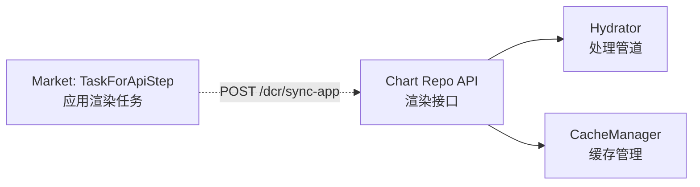
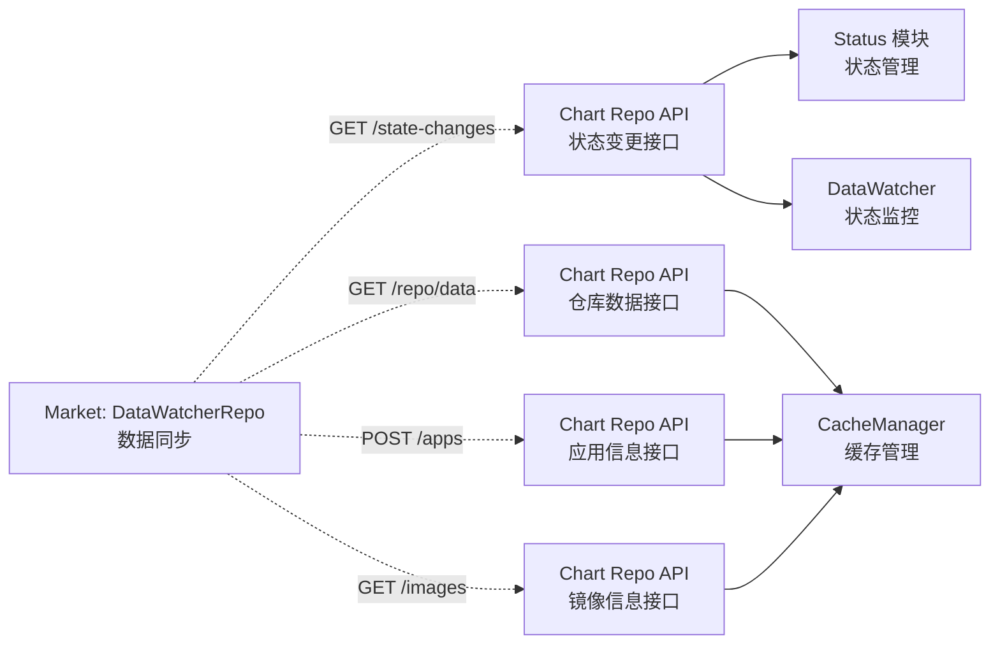
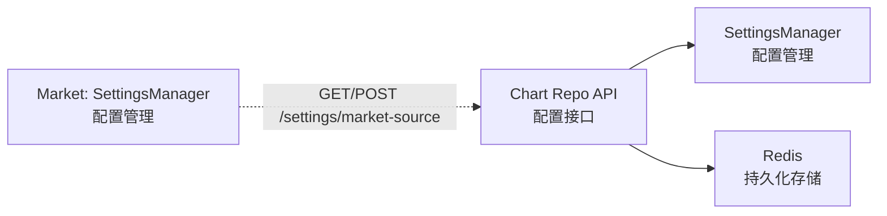
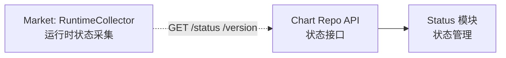
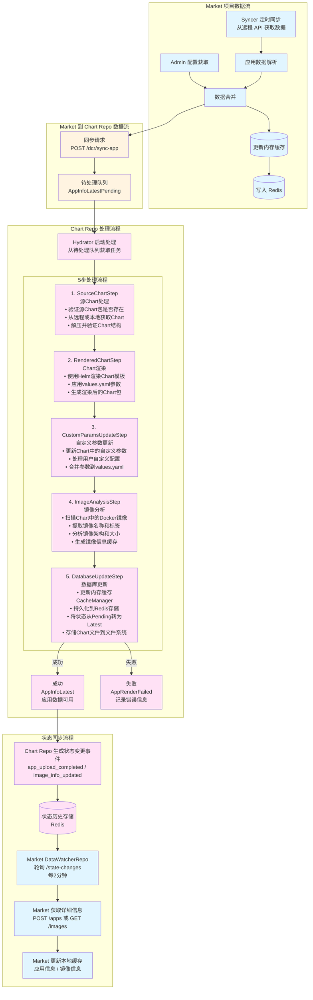
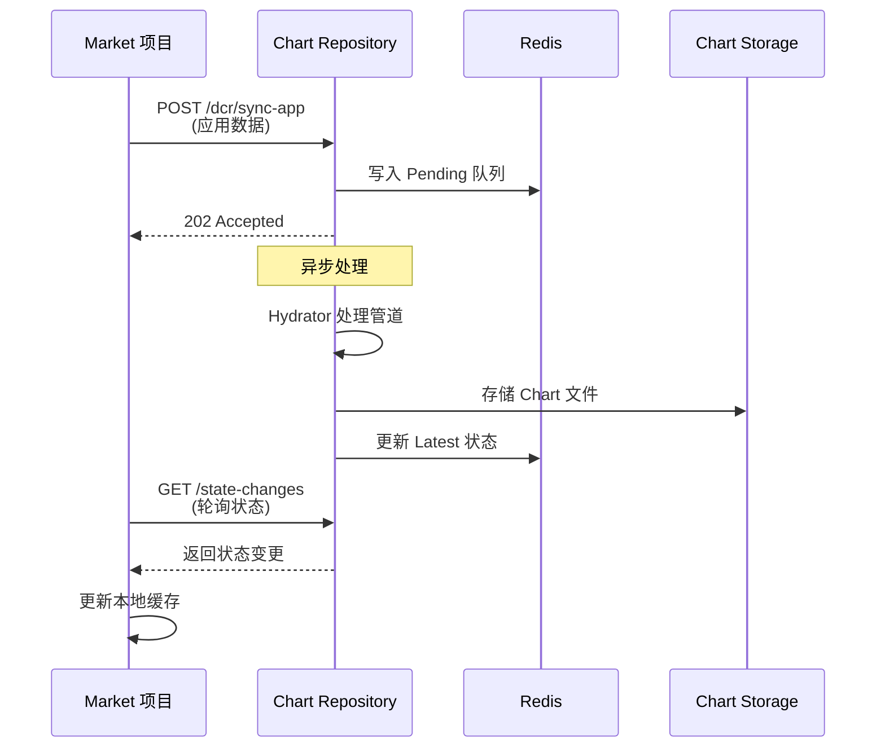
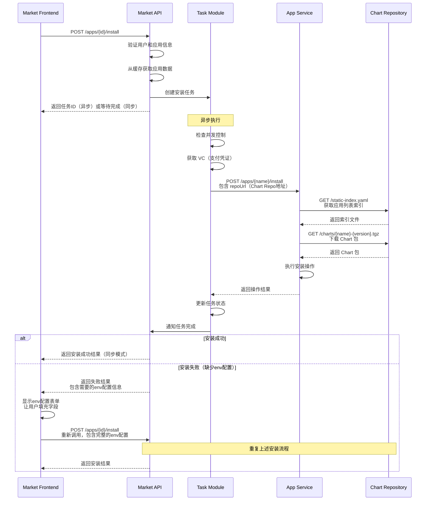
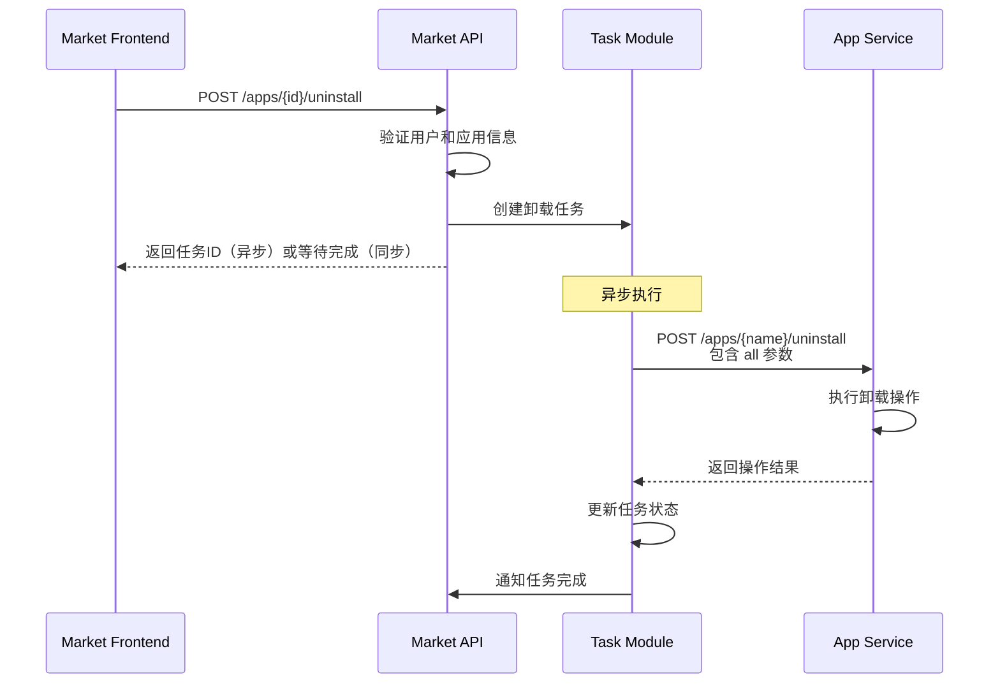
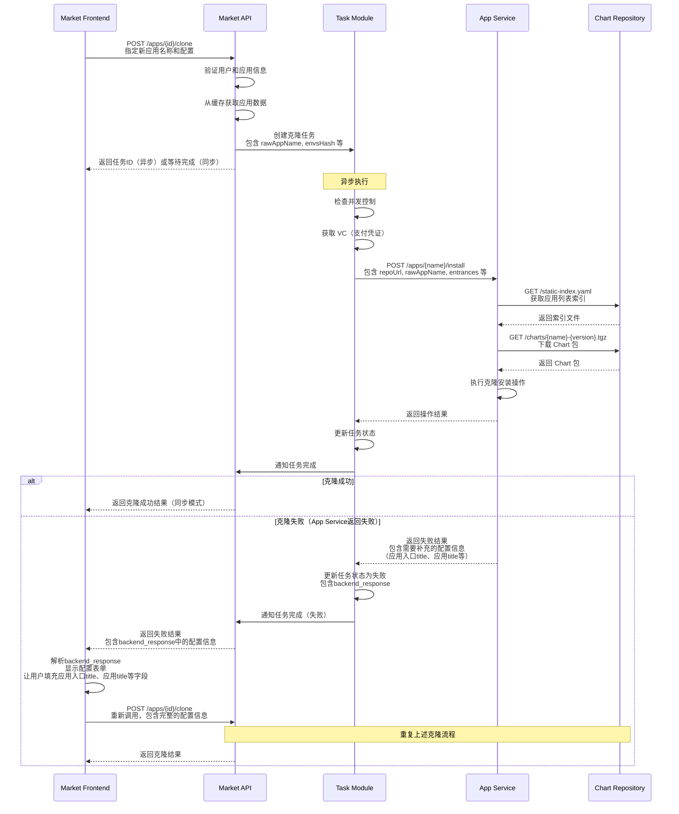

# Market 系统架构

[English Version](architecture-market-system.md) | [中文版本](architecture-market-system.zh-CN.md)

本文档描述了 Market 项目和 Dynamic Chart Repository 项目构成的完整 Market 程序的功能架构。

## 系统架构概览

Market 系统由两个核心项目组成：
- **Market 项目**：应用商店核心服务，负责应用信息管理、任务处理、API 服务
- **Dynamic Chart Repository 项目**：Helm Chart 动态仓库，负责 Chart 渲染、镜像分析、状态管理

## 两个项目之间的交互关系

### 1 应用渲染功能

### 2 数据同步功能

### 3 配置管理功能

### 4 状态监控功能

## 数据流

**颜色说明：**
- 🔵 **蓝色**：Market 项目执行的步骤（包括 Market 的 Redis 存储）
- 🔴 **粉色**：Chart Repo 项目执行的步骤（包括 Chart Repo 的 Redis 存储）
- 🟡 **黄色**：跨项目交互（API 调用）

## 核心交互流程

### 应用同步流程

### 应用安装流程

### 应用卸载流程

### 应用克隆流程

