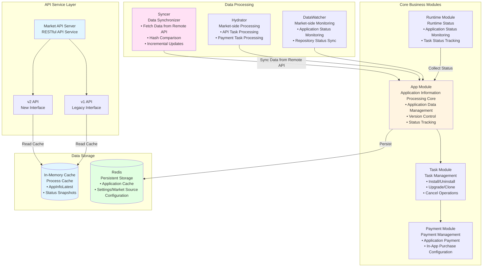
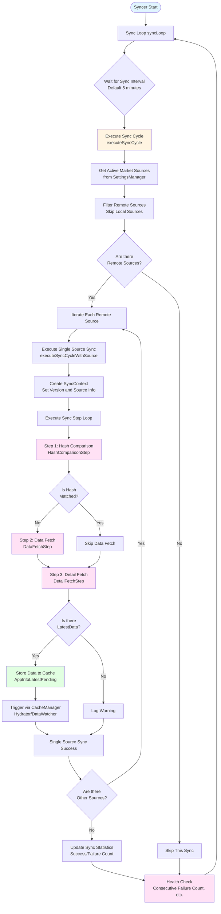

[中文版 (Chinese)](./architecture-market.zh-CN.md) | [English](./architecture-market.md)

# Market Project Internal Architecture

## Syncer Module Operation Logic

### Operation Flow Diagram

### Operation Logic Description

- **Periodic Sync**: Syncer starts a complete sync cycle at configured intervals (default approximately every 5 minutes), reads currently enabled market sources from Settings, and only syncs remote-type sources.
- **Sequential Multi-Source Attempts**: For each remote market source, Syncer sequentially executes preconfigured sync steps. If a single source fails, it logs the error and continues to the next source. Sync is considered successful as long as at least one source succeeds.
- **Step-by-Step Execution**: Each sync cycle sequentially executes multiple Steps (hash comparison, list data fetch, detail data fetch, etc.). Each Step has timeout and skip conditions to avoid long-term blocking.
- **Unified Context and Cache Writing**: Syncer constructs a unified SyncContext for each sync, centrally managing remote version numbers, market source information, and latest data. When complete data is successfully obtained, it writes to cache (AppInfoLatestPending / Others, etc.) and triggers subsequent Hydrator and DataWatcher processing via `CacheManager`.
- **Monitoring and Health Checks**: Syncer internally records metrics such as last sync time, success/failure counts, current step, and last duration. These metrics can determine whether sync is running healthily (e.g., considered unhealthy when there are consecutive failures or no successful sync for a long time).

## Application Runtime Status Correctness Assurance Mechanism

- **Data Source**: The "source of truth" for application runtime status comes from runtime `app-service` (including `/app-service/v1/all/apps` and `/app-service/v1/middlewares/status`). These interfaces report actual status in real-time from the runtime environment.
- **Cache and Snapshots**: Market side maintains status caches such as `AppStateLatest` in memory and Redis, and builds user-level snapshots and hashes based on the cache to determine whether data needs to be synced and pushed.
- **Status Correction Component**: `StatusCorrectionChecker` periodically pulls the latest status from `app-service` and compares it with cached status, identifying the following types of issues:
  - **New Applications**: Records exist on remote but not in local cache → Automatically added to cache and history is recorded.
  - **Disappeared Applications**: Exist in cache but no longer exist on remote → Removed from cache, and related uninstall tasks are attempted to be marked as successful.
  - **Status Changes**: Same application has different status between remote and cache (including entry status changes) → Update cache based on remote and record history.
- **Task Status Correction**: After each status check, `StatusCorrectionChecker` traverses tasks currently in "running" status and aligns them with actual application status, for example:
  - Install/Clone tasks: If the application is already in `running`, mark the task as successful.
  - Uninstall/Cancel install tasks: If the application no longer exists on remote, mark the task as successful.
- **Hash Consistency Maintenance**: After each correction, recalculate user data snapshots and hashes for affected users, and persist the corrected status via `CacheManager.ForceSync` to ensure cache, hashes, and actual runtime status remain consistent.

