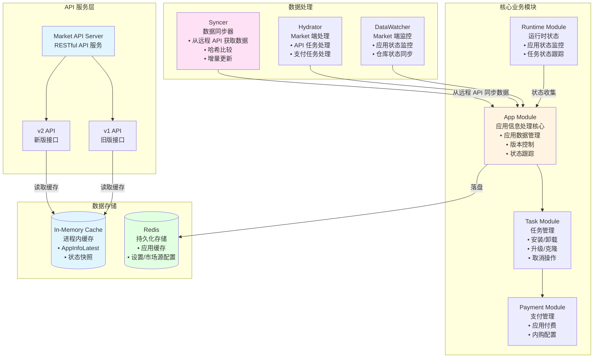
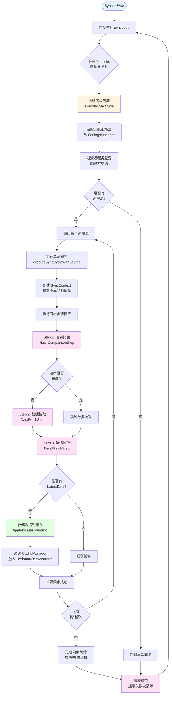

[English](./architecture-market.md) | [中文版 (Chinese)](./architecture-market.zh-CN.md)

# Market 项目内部架构

## Syncer 模块运行逻辑

### 运行流程图

### 运行逻辑说明

- **周期同步**：Syncer 会按配置的间隔（默认约每 5 分钟）启动一次完整同步循环，从 Settings 中读取当前启用的市场源，仅对远程类型的源执行同步。
- **多数据源顺序尝试**：对于每个远程市场源，Syncer 依次执行预配置的同步步骤，如果单个源失败会记录错误并继续尝试下一个源，只要至少有一个源成功，同步就被认为是成功的。
- **分步执行**：每个同步周期会依次执行多个 Step（哈希比较、列表数据拉取、详情数据拉取等），每个 Step 都有超时与可跳过判断，避免长时间阻塞。
- **统一上下文与缓存写入**：Syncer 为每次同步构造统一的 SyncContext，集中管理远程版本号、市场源信息和最新数据；当成功获取完整数据后，会将数据写入到缓存（AppInfoLatestPending / Others 等），并通过 `CacheManager` 触发后续 Hydrator、DataWatcher 的处理。
- **监控与健康检查**：Syncer 内部记录最近一次同步时间、成功/失败次数、当前步骤和最近一次时长等指标，通过这些指标可以判断同步是否健康运行（例如连续多次失败或长时间未成功同步时视为不健康）。

## 应用运行状态正确性保障机制

- **数据来源**：应用运行状态的“真相”来自运行时的 `app-service`（包括 `/app-service/v1/all/apps` 和 `/app-service/v1/middlewares/status`），这些接口由运行环境实时上报实际状态。
- **缓存与快照**：Market 侧在内存与 Redis 中维护 `AppStateLatest` 等状态缓存，并基于缓存构建用户级快照和哈希，用于判断数据是否需要同步与推送。
- **状态纠偏组件**：`StatusCorrectionChecker` 会定期从 `app-service` 拉取最新状态，与缓存中的状态进行对比，识别以下几类问题：
  - **应用新出现**：远端有记录、本地缓存不存在 → 自动补充到缓存中，并记录历史。
  - **应用消失**：缓存中存在、远端已不存在 → 从缓存中移除，并尝试将相关卸载任务标记为成功。
  - **状态变更**：同一应用在远端与缓存中的状态不同（包含入口状态变化）→ 以远端为准更新缓存并记录历史。
- **任务状态矫正**：在每次状态检查结束后，`StatusCorrectionChecker` 会遍历当前处于“运行中”的任务，将其与实际应用状态对齐，例如：
  - 安装/克隆任务：如果应用已经处于 `running`，则补记为任务成功。
  - 卸载/取消安装任务：如果应用在远端已经不存在，则补记为任务成功。
- **哈希一致性维护**：每次纠偏后，针对受影响的用户重新计算用户数据快照和哈希，并通过 `CacheManager.ForceSync` 将修正后的状态持久化，确保缓存、哈希和实际运行状态保持一致。

