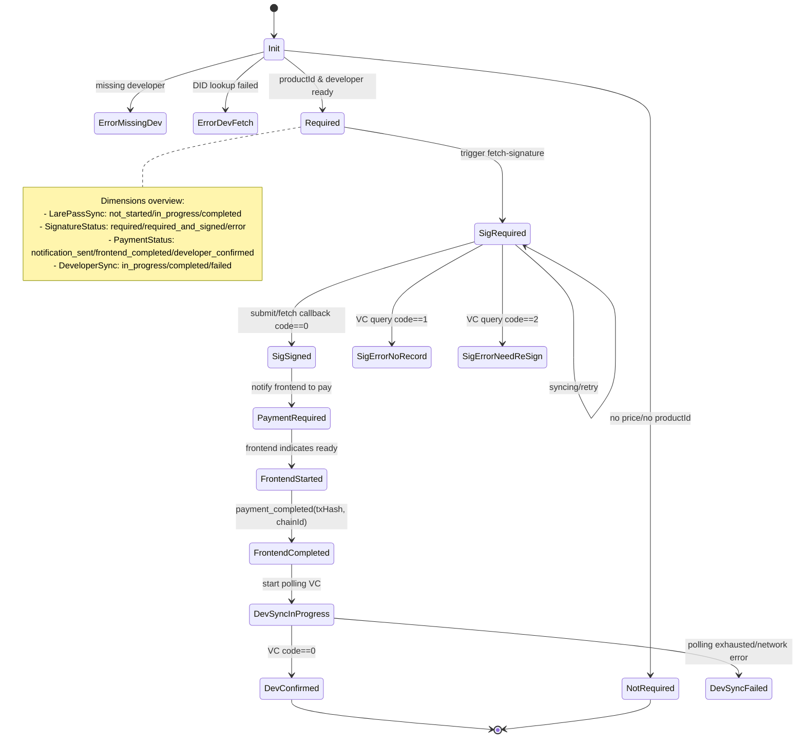

## 1. Overview

**Goal**: Use a dedicated *payment state machine* to manage the full lifecycle of app purchases  
(e.g. a typical success path: preprocessing → obtain signature → submit signature → on-chain payment on the frontend → developer VC confirmation → receipt persistence → frontend notification;  
in practice, free apps, re-signing, and restore-purchase flows will branch off this path).

**State sources and storage**:
- **In-memory**: `PaymentStateMachine.states` (runtime state), `paymentStateStore` (tool-level cache).
- **Redis**:
  - State: `payment:state:{userID}:{appID}:{productID}` (JSON `PaymentState`).
  - Receipt: `payment:receipt:{userID}:{developerName}:{appID}:{productID}` (JSON `PurchaseInfo{VC,Status}`).

**External systems**:
- DID Gate (query developer `DID/RSAPubKey`).
- LarePass (signature initiation and fetch-signature callback).
- Developer checkout service (run by the developer, exposes `AuthService/ActivateAndGrant` etc., returns VC based on JWS).
- Market frontend (app details/purchase entry, payment flow UI, payment status queries, receiving system notifications).

## 2. State Machine Design (Internal)

### Core State Diagram

### Simplified Transition Table

- `SignatureRequired` + submit signature → `SignatureRequiredAndSigned`
- `SignatureRequiredAndSigned` + vc(code=0) → `SignatureNotRequired` + `DeveloperSyncCompleted`
- `PaymentFrontendCompleted` + vc(code=0) → `PaymentDeveloperConfirmed`
- vc(code=1) → `SignatureErrorNoRecord` (suggest retry)
- vc(code=2) → `SignatureErrorNeedReSign` (suggest re-sign)
- Polling failure/network error → `DeveloperSyncFailed`

### Internal State Dimensions (Five Axes)

> These correspond to five fields in the code: `PaymentNeed`, `DeveloperSync`, `LarePassSync`, `SignatureStatus`, `PaymentStatus`.  
> Together they form the *internal coordinate system* of the payment state machine; all external-facing status strings are derived from these dimensions.

- **Payment need (`PaymentNeed`)**  
  - `not_required`: App does not require payment (free app or no valid price config).  
  - `required`: App requires payment (price config and developer info are ready).  
  - `error_missing_developer`: Developer info is missing in price config; payment flow cannot start.  
  - `error_developer_fetch_failed`: Failed to fetch developer info from DID Gate / developer info service.

- **Developer sync (`DeveloperSync`)** – VC sync progress between market and developer checkout  
  - `not_started`: No VC query/poll to developer checkout has been initiated.  
  - `in_progress`: Currently polling or requesting VC from developer checkout.  
  - `completed`: A definitive result has been obtained (VC received, or confirmed “no record” / “need re-sign”).  
  - `failed`: Polling exhausted or network/service errors prevent a reliable result.

- **LarePass sync (`LarePassSync`)** – signature sync progress between market and LarePass  
  - `not_started`: No sign/fetch-signature request has been sent to LarePass.  
  - `in_progress`: A sign or fetch-signature request is in flight; waiting for callbacks or retries.  
  - `completed`: LarePass has returned a result (signature produced or confirmed terminal).  
  - `failed`: Interaction with LarePass failed or was deemed terminal.

- **Signature status (`SignatureStatus`)** – business semantics around JWS  
  - `not_evaluated`: Need for signature has not been evaluated (initial state).  
  - `not_required`: Current flow does not require signature (e.g. free app or special scenarios).  
  - `required`: Signature is required, but no valid JWS is available yet (user has not completed signing).  
  - `required_and_signed`: Signature required and a valid JWS is present; can be used to query VC from developer checkout.  
  - `required_but_pending`: A fetch-signature/re-sign flow is ongoing; final signature result pending.  
  - `error_no_record`: Developer side found no payment record for the current signature (suggest retry/restore).  
  - `error_need_resign`: Signature is invalid/expired and must be re-signed.

- **Payment progress (`PaymentStatus`)** – frontend/on-chain payment progress  
  - `not_evaluated`: Payment progress not yet evaluated (usually right after init).  
  - `not_notified`: “Payment required” has not yet been notified to the frontend.  
  - `notification_sent`: “Payment required” has been sent to the frontend, but the frontend has not started payment.  
  - `frontend_started`: Frontend has indicated it is starting payment; `frontend_data` captures its context.  
  - `frontend_completed`: Frontend has reported on-chain payment completed (with `TxHash` etc.).  
  - `developer_confirmed`: Developer checkout has returned VC; payment is fully confirmed.

### PaymentState (Snapshot of a Single Purchase)

> Represents the current payment state snapshot of a specific user, app, and productId.  
> Also the JSON stored under Redis key `payment:state:{userID}:{appID}:{productID}`.

- **Identity fields**: `UserID`, `AppID`, `AppName`, `SourceID`, `ProductID`, `DeveloperName`  
  Used to uniquely identify a purchase record in memory and Redis, and to link it to a specific app and developer.

- **Developer info**: `Developer{Name,DID,RSAPubKey}`  
  Fetched from DID Gate / developer info service; used to build payment data, call developer checkout, and verify VC.

- **Aggregated internal dimensions**: `PaymentNeed`, `DeveloperSync`, `LarePassSync`, `SignatureStatus`, `PaymentStatus`  
  These are the five internal axes described above, stored together on the state.

- **Associated data**: `JWS`, `SignBody`, `VC`, `TxHash`, `XForwardedHost`, `FrontendData`  
  - `JWS` / `SignBody`: Data related to the LarePass sign/fetch-signature flow.  
  - `VC`: Authorization credential returned by the developer checkout service.  
  - `TxHash`: On-chain payment transaction hash.  
  - `XForwardedHost`: Used to construct callback URLs and derive user DID.  
  - `FrontendData`: Context the frontend attaches when calling `StartFrontendPayment` (entry source, environment, etc.).

- **Metadata**: `CreatedAt`, `UpdatedAt`  
  Used for cleaning up stale states and inspecting when a state was last updated.

- **Helper methods (code-level)**:  
  - `GetKey()`: Generates the `user:app:product` unique key.

### State Machine Storage and Concurrency (Implementation Constraints)

- **Unified storage**: All `PaymentState` instances are written via `PaymentStateMachine` to both an in-memory map and Redis:  
  - In-memory key: `userID:appID:productID` (generated by `GetKey()`).  
  - Redis key: `payment:state:{userID}:{appID}:{productID}`.
- **Access rules**:  
  - Reads: Always read from memory first; on miss, load from Redis and write back to memory (`LoadState`).  
  - Writes/deletes: Done through `SaveState` / `DeleteState` wrappers; business code must not access Redis directly.  
- **Concurrency and reentrancy**:  
  - The in-memory map is protected by an `RWMutex`, and updates use copy–update–replace to avoid races.  
  - VC polling, LarePass interactions, and similar flows have reentrancy guards (e.g. `DeveloperSyncInProgress` checks) so that network flakiness does not cause deadlocks or duplicate work.

## 3. State Machine External Surface (API & Frontend)

### 3.1 Public APIs (by caller)

- **Frontend entry points**
  - `GET /api/v2/sources/{source}/apps/{id}/payment-status`  
    - Function: `GetPaymentStatus(userID, appID, sourceID, xForwardedHost, appInfo)`  
    - Use case: Called on app detail/install pages to determine the user's purchase status and render "buy / bought / continue payment" UI.  
  - `POST /api/v2/sources/{source}/apps/{id}/purchase`  
    - Function: `PurchaseApp(userID, appID, sourceID, xForwardedHost, appInfo)`  
    - Use case: Called when the user clicks "buy". Drives the state machine to either initiate signing, return payment data, or report "already purchased" depending on the internal state.  
  - `POST /api/v2/payment/frontend-start`  
    - Function: `StartFrontendPayment(userID, appID, sourceID, productID, xForwardedHost, appInfo, frontendData)`  
    - Use case: Called when the frontend is about to start on-chain payment (e.g. before opening a wallet), to store context and mark `payment_frontend_started`.  
  - `POST /api/v2/payment/start-polling`  
    - Function: `StartPaymentPolling(userID, sourceID, appID, productID, txHash, xForwardedHost, systemChainID, appInfoLatest)`  
    - Use case: Called after the frontend reports on-chain success, to write `txHash` and start polling the developer checkout for VC.

- **LarePass callback entry points**
  - `POST /api/v2/payment/submit-signature`  
    - Function: `ProcessSignatureSubmission(jws, signBody, user, xForwardedHost)`  
    - Use case: Handles the "submit-signature" callback, writes `JWS/SignBody`, and advances signature state to `required_and_signed`.  
  - `POST /api/v2/payment/fetch-signature-callback`  
    - Function: `HandleFetchSignatureCallback(jws, signBody, user, signed)`  
    - Use case: Handles the "fetch-signature" callback, updating `SignatureStatus`/`LarePassSync` based on `signed` and payload, and continues VC sync when appropriate.

- **Backend/internal use**
  - `InitStateMachine(dataSender, settingsManager)`: Initialize the global state machine instance.  
  - `PreprocessAppPaymentData(ctx, appInfo, userID, sourceID, settingsManager, client)`: Bootstrap/correct `PaymentState` when fetching app details.  
  - `ListPaymentStates()`: Debug/monitoring view of current in-process states.

### 3.2 Frontend-visible Status Mapping (Suggested)

> This section maps external status strings returned to the frontend to *typical* combinations of internal dimensions + key fields.  
> Implementation may contain additional guard paths, but semantics should remain consistent with this table.

- `purchased`  
  - Typical internal combination:  
    - `DeveloperSync=completed` and `VC` is non-empty.  
  - Meaning: User has completed payment and holds a valid license; frontend may show “purchased, ready to install”.

- `waiting_developer_confirmation`  
  - Typical internal combination:  
    - `PaymentStatus=frontend_completed` and `DeveloperSync` not yet `completed`.  
  - Meaning: On-chain payment is done, backend is waiting for the developer checkout to return VC.

- `payment_frontend_started`  
  - Typical internal combination:  
    - `PaymentStatus=frontend_started`.  
  - Meaning: Frontend has entered the payment flow (e.g. wallet opened / transaction being prepared), but the chain result is not yet final.

- `payment_required`  
  - Typical internal combinations (at least one):  
    - `SignatureStatus=required_and_signed` and no payment record yet;  
    - or `JWS` exists and `PaymentStatus=notification_sent`.  
  - Meaning: Signature is ready; backend can return `payment_data` to let the user perform on-chain payment.

- `payment_retry_required`  
  - Typical internal combination:  
    - `SignatureStatus=error_no_record` while local `JWS` is kept and `PaymentStatus` is at least `notification_sent` / `frontend_started` / `frontend_completed`.  
  - Meaning: Developer side has no matching payment record but there is local evidence of prior payment; frontend should expose a “retry/restore purchase” path.

- `notification_sent`  
  - Typical internal combination:  
    - `PaymentStatus=notification_sent` and signature/payment have not yet progressed further.  
  - Meaning: Backend has notified the frontend that payment is required, but the user has not started payment yet.

- `not_buy` / `not_notified` / `not_evaluated`  
  - Typical internal combination:  
    - `PaymentStatus` still `not_evaluated` or `not_notified`, and `ProductID` is non-empty.  
  - Meaning: No payment/signature flow has started; treat as “not purchased” and show a purchase button.

- `signature_required`  
  - Typical internal combination:  
    - `SignatureStatus=required` or `required_but_pending`.  
  - Meaning: User needs to complete signing; frontend should guide the user to open LarePass or the appropriate signing UI.

- `signature_no_record`  
  - Typical internal combination:  
    - `SignatureStatus=error_no_record` and retry conditions not yet met.  
  - Meaning: Developer checkout found no payment record for the current signature; frontend should guide the user to retry or use a restore-purchase flow.

- `signature_need_resign`  
  - Typical internal combination:  
    - `SignatureStatus=error_need_resign`.  
  - Meaning: Signature is invalid/expired; user must re-sign to continue.

- Other error-like states (`error_*`)  
  - Typical internal combination:  
    - `PaymentNeed` is in an error state (e.g. `error_missing_developer` / `error_developer_fetch_failed`), or `DeveloperSync=failed`, etc.  
  - Meaning: Configuration/network/third-party issues; frontend should let the user retry later or contact support.

### 3.3 Push & Notifications (Frontend / LarePass)

- **Push to frontend (`MarketSystemUpdate`)**
  - `payment_required`  
    - Sender: `notifyFrontendPaymentRequired`  
    - When: Backend has a ready signature and needs the user to initiate payment  
      (e.g. during `PurchaseApp` / `ProcessSignatureSubmission` when deciding to send `payment_data`).  
  - `purchased`  
    - Sender: `notifyFrontendPurchaseCompleted`  
    - When: After the state machine processes `vc_received`, successfully writes VC and persists the receipt.  
  - Other state updates (`syncing`, `waiting_developer_confirmation`, `signature_no_record`, `signature_need_resign`,  
    `payment_retry_required`, `not_buy`, etc.)  
    - Sender: `notifyFrontendStateUpdate`  
    - When:  
      - LarePass callbacks or VC query results cause internal state transitions to one of these states;  
      - VC polling reaches its maximum attempts or encounters specific error codes (e.g. 1 = no record, 2 = need re-sign).

- **Push to LarePass (`SignNotificationUpdate`)**
  - Topic `market_payment` (start-signature)  
    - Builder: `notifyLarePassToSign`  
    - When:  
      - On first time signature is required (`SignatureStatus=required`) and a valid callback host is present (e.g. from `start_payment`);  
      - Or when signature is marked `error_need_resign` and the state machine decides to restart the signing flow.
  - Topic `fetch_payment_signature` (fetch-signature)  
    - Builder: `notifyLarePassToFetchSignature`  
    - When:  
      - During preprocessing or `PurchaseApp` when `triggerPaymentStateSync` sees a state that should pull signature from LarePass  
        (typically when the user has signed before but local JWS is missing).
  - Topic `save_payment_vc` (persist VC)  
    - Builder: `notifyLarePassToSaveVC`  
    - When: After the state machine processes `vc_received` and persists the receipt; if the first push might be missed, a compensating push can be triggered via `POST /api/v2/payment/resend-vc`.

## 4. Open Issues & Design Considerations

### 4.1 Product Evolution vs. Restore-Purchase

When product definitions evolve between installs, restore-purchase becomes ambiguous:
1. User purchases an app and completes installation.  
2. The purchased `productID` is deprecated and replaced by a new `productID`.  
3. User uninstalls the app and later reinstalls it.

Because the original `productID` no longer exists, the market cannot tell which historical product the user owns.  
Querying every historical `productID` would bloat `price.yaml`, and each query would have to flow through LarePass, degrading UX.  
The recommended approach is for the frontend to present a “Restore Purchases” page or modal: opening it triggers the market to fetch historical products from GitBot, let the user choose an entry, and then continue with the standard restore flow.
