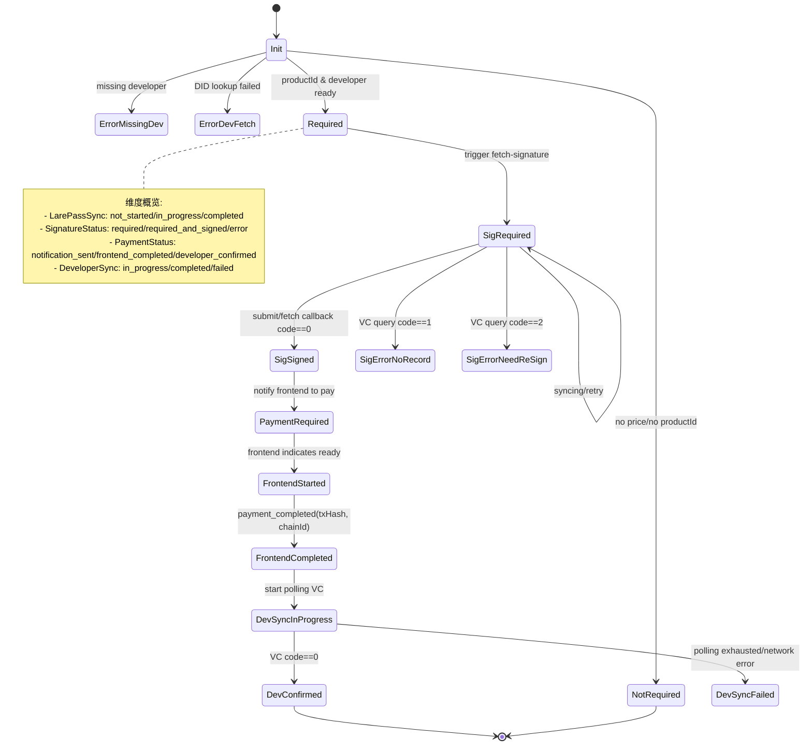

## 1. 概览与快速认知

**目标**: 使用"支付状态机"管理应用购买的完整生命周期（例如典型成功路径：预处理 → 获取签名 → 提交签名 → 前端支付 → 开发者 VC 确认 → 收据持久化 → 前端通知；实际流程可根据免费应用、补签、恢复购买等场景分支）。

**状态来源和存储**:
- **内存**: `PaymentStateMachine.states`（运行时状态），`paymentStateStore`（工具层缓存）。
- **Redis**: 状态 `payment:state:{userID}:{appID}:{productID}`，购买收据 `payment:receipt:{userID}:{developerName}:{appID}:{productID}`。

**外部系统**:
- DID Gate（查询开发者 `DID/RSAPubKey`）。
- LarePass（签名启动和获取签名回调）。
- 开发者收银台服务（由开发者运行，暴露 `AuthService/ActivateAndGrant` 等接口，基于 JWS 返回 VC）。
- 市场前端（应用详情/购买入口、支付流程展示、支付状态查询、系统通知接收等交互）。

## 2. 状态机设计

### 状态机图（核心）

### 状态转换表（简化）

- `SignatureRequired` + 提交签名 → `SignatureRequiredAndSigned`
- `SignatureRequiredAndSigned` + vc(code=0) → `SignatureNotRequired` + `DeveloperSyncCompleted`
- `PaymentFrontendCompleted` + vc(code=0) → `PaymentDeveloperConfirmed`
- vc(code=1) → `SignatureErrorNoRecord`（建议重试）
- vc(code=2) → `SignatureErrorNeedReSign`（建议重新签名）
- 轮询失败/网络错误 → `DeveloperSyncFailed`

### 内部状态维度（五个维度）

> 对应代码中的五个字段: `PaymentNeed`, `DeveloperSync`, `LarePassSync`, `SignatureStatus`, `PaymentStatus`。  
> 它们一起构成支付状态机的“内部坐标系”，对外状态字符串都由这五个维度推导而来。

- **支付需求维度 `PaymentNeed`**  
  - `not_required`: 当前应用不需要支付（免费应用或没有有效价格配置）。  
  - `required`: 当前应用需要支付（价格配置和开发者信息已准备好）。  
  - `error_missing_developer`: 价格配置中缺少开发者信息，无法发起支付流程。  
  - `error_developer_fetch_failed`: 从 DID Gate / 开发者信息服务获取开发者信息失败。

- **开发者同步维度 `DeveloperSync`**（市场 ↔ 开发者收银台的 VC 同步进度）  
  - `not_started`: 尚未向开发者收银台发起 VC 查询/轮询。  
  - `in_progress`: 正在向开发者收银台轮询或请求 VC。  
  - `completed`: 已拿到明确结果（拿到 VC 或确定没有记录 / 需要重签）。  
  - `failed`: 轮询耗尽或网络/服务异常导致无法得到可靠结果。

- **LarePass 同步维度 `LarePassSync`**（市场 ↔ LarePass 的签名同步进度）  
  - `not_started`: 尚未向 LarePass 发送签名/取签请求。  
  - `in_progress`: 已向 LarePass 发出签名或取签请求，等待回调或重试中。  
  - `completed`: LarePass 已返回结果（签名成功或已明确无需继续）。  
  - `failed`: 与 LarePass 的交互失败或被判定为终止状态。

- **签名状态维度 `SignatureStatus`**（围绕 JWS 的业务语义）  
  - `not_evaluated`: 尚未评估是否需要签名（初始状态）。  
  - `not_required`: 当前流程不需要签名（例如免费应用或某些特殊场景）。  
  - `required`: 需要签名，但尚未拿到有效 JWS（或用户还未完成签名）。  
  - `required_and_signed`: 需要签名且已拿到有效 JWS，可用于向开发者收银台发起 VC 查询。  
  - `required_but_pending`: 已发起取签/补签流程，签名结果仍在进行中。  
  - `error_no_record`: 开发者侧基于当前签名查不到任何支付记录（推荐提示重试/恢复购买）。  
  - `error_need_resign`: 签名失效或不再可用，需要用户重新签名。

- **支付进度维度 `PaymentStatus`**（围绕前端/链上支付进度）  
  - `not_evaluated`: 尚未评估支付进度（通常是刚初始化）。  
  - `not_notified`: 尚未向前端发出“需要支付”的通知。  
  - `notification_sent`: 已向前端发送过“需要支付”的通知，但前端尚未声明开始支付。  
  - `frontend_started`: 前端已声明开始支付，`frontend_data` 中记录了前端上下文。  
  - `frontend_completed`: 前端已上报链上支付完成（含 `TxHash` 等信息）。  
  - `developer_confirmed`: 开发者收银台已返回 VC，支付完成并已确认授权。

### PaymentState（单次购买的状态快照）

> 表示“某个用户对某个应用中某个 productId 的当前支付状态快照”，  
> 也是 Redis `payment:state:{userID}:{appID}:{productID}` 这类键对应的 JSON 内容。

- **标识信息**: `UserID`, `AppID`, `AppName`, `SourceID`, `ProductID`, `DeveloperName`  
  用于在内存和 Redis 中唯一标识一条购买记录，并关联到具体应用与开发者。

- **开发者信息**: `Developer{Name,DID,RSAPubKey}`  
  从 DID Gate / 开发者信息服务获取，用于构造支付数据、调用开发者收银台、验证 VC 等。

- **内部状态维度聚合**: `PaymentNeed`, `DeveloperSync`, `LarePassSync`, `SignatureStatus`, `PaymentStatus`  
  即上一小节介绍的五个内部维度，这里只作为聚合字段出现。

- **关联数据**: `JWS`, `SignBody`, `VC`, `TxHash`, `XForwardedHost`, `FrontendData`  
  - `JWS` / `SignBody`: 与 LarePass 签名 / 取签流程相关的数据。  
  - `VC`: 开发者收银台返回的授权凭证。  
  - `TxHash`: 链上支付交易哈希。  
  - `XForwardedHost`: 用于构建回调 URL、推导用户 DID。  
  - `FrontendData`: 前端在 `StartFrontendPayment` 阶段附加的上下文（入口来源、环境信息等）。

- **元数据**: `CreatedAt`, `UpdatedAt`  
  用于清理过期状态、排障时查看最近状态更新时间。

- **辅助方法（代码层语义）**:  
  - `GetKey()`: 按 `user:app:product` 规则生成唯一键。  

### 状态机存储与并发（实现约束）

- **统一存储**: 所有 `PaymentState` 都通过 `PaymentStateMachine` 同时写入内存 map 和 Redis，键分别是:  
  - 内存键: `userID:appID:productID`（由 `GetKey()` 生成）；  
  - Redis 键: `payment:state:{userID}:{appID}:{productID}`。
- **访问规则**:  
  - 读取: 始终优先读内存，未命中时从 Redis 加载并写回内存（`LoadState`）。  
  - 写入/删除: 通过状态机封装的 `SaveState` / `DeleteState` 完成，禁止业务代码直接访问 Redis。  
- **并发与重入**:  
  - 内存 map 由 `RWMutex` 保护，状态更新采用“复制-更新-替换”的方式，避免读写竞争。  
  - 轮询 VC、触发 LarePass 等流程内部带有重入保护（例如 `DeveloperSyncInProgress` 检查），网络抖动不会导致流程死锁或重复执行。

## 3. 状态机外部（API、前端）

### 3.1 对外 API（按使用者划分）

- **前端调用入口**
  - `GET /api/v2/sources/{source}/apps/{id}/payment-status`  
    - 函数: `GetPaymentStatus(userID, appID, sourceID, xForwardedHost, appInfo)`  
    - 用途: 在详情页/安装入口查询当前用户对某个应用的支付状态，用于展示"购买/已购买/继续支付"等按钮。  
  - `POST /api/v2/sources/{source}/apps/{id}/purchase`  
    - 函数: `PurchaseApp(userID, appID, sourceID, xForwardedHost, appInfo)`  
    - 用途: 用户点击"购买"时调用，驱动状态机根据内部状态决定是发起签名、直接返回支付数据还是提示已购买。  
  - `POST /api/v2/payment/frontend-start`  
    - 函数: `StartFrontendPayment(userID, appID, sourceID, productID, xForwardedHost, appInfo, frontendData)`  
    - 用途: 前端准备好链上支付（例如打开钱包前）时，把一些上下文数据写入状态机，并把进度标记为 `payment_frontend_started`。  
  - `POST /api/v2/payment/start-polling`  
    - 函数: `StartPaymentPolling(userID, sourceID, appID, productID, txHash, xForwardedHost, systemChainID, appInfoLatest)`  
    - 用途: 前端在链上支付成功后，上报 `txHash` 并触发后端开始向开发者收银台轮询 VC。
- `POST /api/v2/payment/resend-vc`  
  - 函数: `ResendPaymentVCToLarePass(userID, productID)`（路由层在 `pkg/v2/api` 调用）  
  - 用途: 当支付已确认（VC 已存在）时，补偿性地将 VC 重新推送到 LarePass（topic: `save_payment_vc`），避免首次推送丢失导致状态不同步。

- **LarePass 回调入口**
  - `POST /api/v2/payment/submit-signature`  
    - 函数: `ProcessSignatureSubmission(jws, signBody, user, xForwardedHost)`  
    - 用途: 处理"提交签名"回调，写入 `JWS/SignBody` 并将签名状态推进到 `required_and_signed`。  
  - `POST /api/v2/payment/fetch-signature-callback`  
    - 函数: `HandleFetchSignatureCallback(jws, signBody, user, signed)`  
    - 用途: 处理"取签名"回调，根据 `signed` 与返回内容更新 `SignatureStatus`/`LarePassSync`，并在成功时继续发起 VC 同步。

- **后台/内部使用**
  - `InitStateMachine(dataSender, settingsManager)`：初始化全局状态机实例。  
  - `PreprocessAppPaymentData(ctx, appInfo, userID, sourceID, settingsManager, client)`：在拉取应用详情时预先创建/修正 `PaymentState`。  
  - `ListPaymentStates()`：仅用于调试和监控当前进程内的状态机快照。

### 3.2 前端可见状态映射（建议）

> 下表描述“对前端返回的状态字符串”和“内部五维状态 + 关键字段”的典型组合关系，真实实现中可能还有更多保护分支，但不会偏离这里的主语义。

- `purchased`  
  - 内部典型组合:  
    - `DeveloperSync=completed` 且 `VC` 非空；  
  - 含义: 用户已经完成支付并拿到授权，前端可以直接展示“已购买，可安装”。

- `waiting_developer_confirmation`  
  - 内部典型组合:  
    - `PaymentStatus=frontend_completed` 且 `DeveloperSync` 尚未 `completed`；  
  - 含义: 链上支付已完成，后端正在等待开发者收银台返回 VC。

- `payment_frontend_started`  
  - 内部典型组合:  
    - `PaymentStatus=frontend_started`；  
  - 含义: 前端已进入支付流程（例如已经调起钱包或准备发送交易），但链上结果尚未确定。

- `payment_required`  
  - 内部典型组合（至少满足其一）:  
    - `SignatureStatus=required_and_signed` 且尚未产生支付记录；  
    - 或 `JWS` 已存在且 `PaymentStatus=notification_sent`；  
  - 含义: 签名已就绪，可以向前端返回 `payment_data`，让用户发起链上支付。

- `payment_retry_required`  
  - 内部典型组合:  
    - `SignatureStatus=error_no_record`，同时本地仍保留 `JWS` 且 `PaymentStatus` 至少达到 `notification_sent`/`frontend_started`/`frontend_completed` 之一；  
  - 含义: 开发者侧查不到支付记录，但本地有签名与历史支付痕迹，建议前端提供“重新发起支付/恢复购买”入口。

- `notification_sent`  
  - 内部典型组合:  
    - `PaymentStatus=notification_sent`，且签名/支付尚未继续推进；  
  - 含义: 后端已经向前端发出“需要支付”的通知，但前端还没开始支付。

- `not_buy` / `not_notified` / `not_evaluated`  
  - 内部典型组合:  
    - `PaymentStatus` 仍在 `not_evaluated` 或 `not_notified`，且 `ProductID` 非空；  
  - 含义: 尚未进入任何支付/签名流程，可视为“未购买”，前端可以展示“购买”按钮。

- `signature_required`  
  - 内部典型组合:  
    - `SignatureStatus=required` 或 `required_but_pending`；  
  - 含义: 当前流程需要用户完成签名，前端应引导用户打开 LarePass 或相应签名界面。

- `signature_no_record`  
  - 内部典型组合:  
    - `SignatureStatus=error_no_record` 且尚未满足重试条件；  
  - 含义: 开发者收银台侧没有找到与当前签名匹配的支付记录，通常建议用户重试或走“恢复购买”流程。

- `signature_need_resign`  
  - 内部典型组合:  
    - `SignatureStatus=error_need_resign`；  
  - 含义: 签名已过期或无效，需要用户重新发起签名流程。

- 其他错误类（`error_*`）  
  - 内部典型组合:  
    - `PaymentNeed` 为错误态（如 `error_missing_developer` / `error_developer_fetch_failed`），或 `DeveloperSync=failed` 等；  
  - 含义: 配置/网络/第三方服务异常，应引导用户稍后重试或联系支持。

### 3.3 推送与通知（前端 / LarePass）

- **推送给前端（通过 `MarketSystemUpdate`）**
  - `payment_required`  
    - 发送者: `notifyFrontendPaymentRequired`  
    - 发送时机: 后端确认签名已就绪且需要用户发起支付时，例如 `PurchaseApp` / `ProcessSignatureSubmission` 中决定应向前端下发 `payment_data`。  
  - `purchased`  
    - 发送者: `notifyFrontendPurchaseCompleted`  
    - 发送时机: 状态机处理 `vc_received` 后，成功写入 VC 并持久化收据时，通知前端“已购买”。  
  - 其他状态更新（如 `syncing` / `waiting_developer_confirmation` / `signature_no_record` / `signature_need_resign` / `payment_retry_required` / `not_buy` 等）  
    - 发送者: `notifyFrontendStateUpdate`  
    - 发送时机:  
      - LarePass 回调或 VC 查询结果导致内部状态切换为上述状态时；  
      - 轮询 VC 达到最大次数或出现特定错误码（例如 1=无记录、2=需重签）时。

- **推送给 LarePass（通过 `SignNotificationUpdate`）**
  - 主题 `market_payment`（启动签名）  
    - 构造者: `notifyLarePassToSign`  
    - 发送时机:  
      - 初次需要签名（例如 `start_payment` 判定 `SignatureStatus=required` 且具备回调域名）时；  
      - 或签名被标记为 `error_need_resign` 后，状态机认为需要重新发起签名流程时。  
  - 主题 `fetch_payment_signature`（取签名）  
    - 构造者: `notifyLarePassToFetchSignature`  
    - 发送时机: 预处理或 `PurchaseApp` 调用 `triggerPaymentStateSync` 时，发现签名状态允许/需要从 LarePass 主动拉取签名（通常在用户此前已签过但本地缺少 JWS 的场景）。
  - 主题 `save_payment_vc`（保存 VC）  
    - 构造者: `notifyLarePassToSaveVC`  
    - 发送时机: 状态机处理 `vc_received`、确认 VC 并落库后自动推送；若首推可能未达，可通过 `POST /api/v2/payment/resend-vc` 再次补偿推送。

## 4. 待解决问题与设计考量

### 4.1 待解决问题

当产品定义在安装之间发生变化时，恢复历史购买变得模糊:
1. 用户购买应用并完成安装。
2. 购买的 `productID` 被废弃并替换为新的 `productID`。
3. 用户卸载应用，稍后重新安装。

由于原始 `productID` 不再存在，市场无法确定拥有哪个历史产品。查询每个历史 `productID` 会使 `price.yaml` 膨胀，并且每个查询必须通过 LarePass 推送，导致体验不佳。推荐方法是前端呈现"恢复历史购买"页面或模态框。打开它会触发市场从 GitBot 获取历史产品，让用户选择所需条目，然后继续正常的恢复流程。
