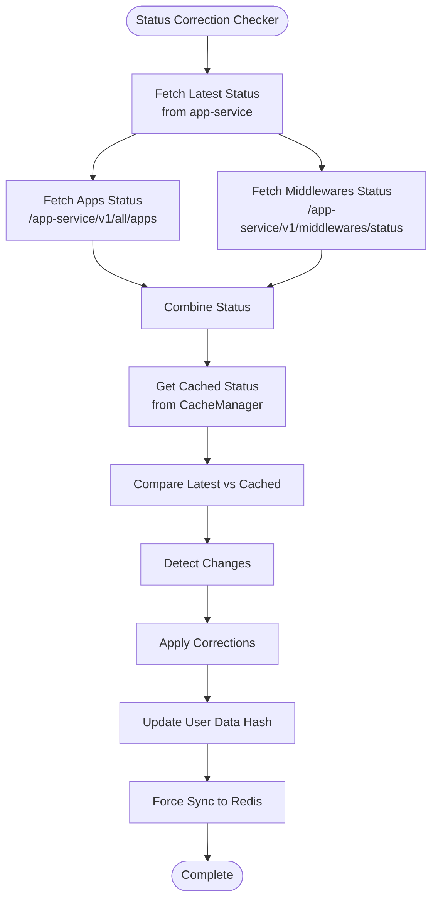

# Status Correction Module

[中文版 (Chinese)](./status-correction-module.zh-CN.md)

## Overview

The Status Correction Module (`StatusCorrectionChecker`) is a critical component of the Market system that ensures consistency between the cached application states and the actual runtime states reported by `app-service`. It periodically checks and corrects discrepancies to maintain data integrity.

## Architecture

- **Implementation**: `internal/v2/appinfo/status_correction_check.go`
- **Dependencies**:
  - `CacheManager`: Manages application state cache
  - `HistoryModule`: Records correction events
  - `TaskModule`: Manages task status corrections

### Data Flow



## Configuration

### Environment Variables

- `APP_SERVICE_SERVICE_HOST`: App service host (default: `localhost`)
- `APP_SERVICE_SERVICE_PORT`: App service port (default: `80`)

### Check Interval

- **Default**: 2 minutes
- **Configurable**: Can be set via `SetCheckInterval()` method
- **Initial Check**: Performed immediately upon start

## Status Comparison

The module compares latest status from `app-service` with cached status and corrects the following discrepancies:

| Change Type | Detection | Action |
|------------|-----------|--------|
| App Appeared | Application exists in `app-service` but not in cache | Automatically added to cache, related install/clone tasks marked as succeeded |
| App Disappeared | Application exists in cache but not in `app-service` | Removed from cache, related uninstall tasks marked as succeeded |
| State Change | Same application has different states in `app-service` vs cache | Cache updated with state from `app-service` (source of truth), entrance statuses updated if changed |

After applying corrections, the module recalculates user data snapshot and hash for affected users, then forces sync to Redis to ensure cache state matches runtime state.

## API Reference

### Methods

#### `NewStatusCorrectionChecker(cacheManager *CacheManager) *StatusCorrectionChecker`

Creates a new status correction checker instance.

**Parameters**:
- `cacheManager`: Cache manager instance

**Returns**: New checker instance

#### `Start() error`

Starts the periodic status checking loop.

**Returns**: Error if already running or cache manager is nil

#### `Stop()`

Stops the periodic status checking loop.

#### `IsRunning() bool`

Returns whether the checker is currently running.

#### `GetStats() map[string]interface{}`

Returns statistics about the checker:

```go
{
    "is_running": bool,
    "check_interval": time.Duration,
    "last_check_time": time.Time,
    "check_count": int64,
    "correction_count": int64,
    "app_service_url": string,
    "middleware_service_url": string
}
```

#### `ForceCheck() error`

Performs an immediate status check (bypasses the interval).

**Returns**: Error if checker is not running

#### `SetCheckInterval(interval time.Duration)`

Sets the check interval.

**Parameters**:
- `interval`: New check interval

#### `SetHistoryModule(hm *history.HistoryModule)`

Sets the history module for recording correction events.

#### `SetTaskModule(tm *task.TaskModule)`

Sets the task module for task status corrections.

## Data Structures

### StatusChange

Represents a detected status change:

```go
type StatusChange struct {
    UserID          string                 `json:"user_id"`
    SourceID        string                 `json:"source_id"`
    AppName         string                 `json:"app_name"`
    ChangeType      string                 `json:"change_type"` // "state_change", "app_disappeared", "app_appeared", "state_inconsistency"
    OldState        string                 `json:"old_state"`
    NewState        string                 `json:"new_state"`
    EntranceChanges []EntranceStatusChange `json:"entrance_changes,omitempty"`
    Timestamp       time.Time              `json:"timestamp"`
}
```

### EntranceStatusChange

Represents a change in entrance status:

```go
type EntranceStatusChange struct {
    EntranceName string `json:"entrance_name"`
    OldState     string `json:"old_state"`
    NewState     string `json:"new_state"`
}
```

## Related Documentation

- [Market Architecture](./architecture-market.md)
- [Task Module](../internal/v2/task/README.md)
- [History Module](./history-module.md)

