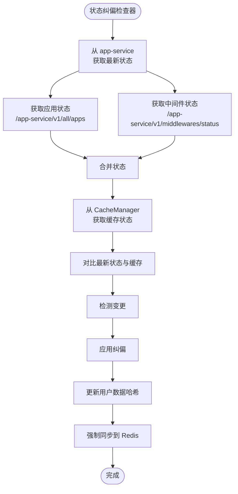

# 状态纠偏模块

[English](./status-correction-module.md)

## 概述

状态纠偏模块（`StatusCorrectionChecker`）是 Market 系统的关键组件，用于确保缓存中的应用状态与 `app-service` 上报的实际运行时状态保持一致。它定期检查并纠正不一致，以维护数据完整性。

## 架构

- **实现文件**：`internal/v2/appinfo/status_correction_check.go`
- **依赖模块**：
  - `CacheManager`：管理应用状态缓存
  - `HistoryModule`：记录纠偏事件
  - `TaskModule`：管理任务状态纠偏

### 数据流



## 配置

### 环境变量

- `APP_SERVICE_SERVICE_HOST`：应用服务主机（默认：`localhost`）
- `APP_SERVICE_SERVICE_PORT`：应用服务端口（默认：`80`）

### 检查间隔

- **默认值**：2 分钟
- **可配置**：可通过 `SetCheckInterval()` 方法设置
- **初始检查**：启动时立即执行

## 状态对比

模块对比 `app-service` 的最新状态与缓存状态，纠正以下不一致：

| 变更类型 | 检测条件 | 纠偏操作 |
|---------|---------|---------|
| 应用出现 | 应用在 `app-service` 中存在但缓存中不存在 | 自动添加到缓存，相关安装/克隆任务标记为成功 |
| 应用消失 | 应用在缓存中存在但在 `app-service` 中不存在 | 从缓存中移除，相关卸载任务标记为成功 |
| 状态变更 | 同一应用在 `app-service` 和缓存中的状态不同 | 使用 `app-service` 的状态更新缓存（以远端为准），入口状态如有变化也会更新 |

应用纠偏后，模块会为受影响的用户重新计算用户数据快照和哈希，然后强制同步到 Redis，确保缓存状态与运行时状态匹配。

## API 参考

### 方法

#### `NewStatusCorrectionChecker(cacheManager *CacheManager) *StatusCorrectionChecker`

创建新的状态纠偏检查器实例。

**参数**：
- `cacheManager`：缓存管理器实例

**返回**：新的检查器实例

#### `Start() error`

启动定期状态检查循环。

**返回**：如果已在运行或缓存管理器为 nil，则返回错误

#### `Stop()`

停止定期状态检查循环。

#### `IsRunning() bool`

返回检查器是否正在运行。

#### `GetStats() map[string]interface{}`

返回检查器的统计信息：

```go
{
    "is_running": bool,
    "check_interval": time.Duration,
    "last_check_time": time.Time,
    "check_count": int64,
    "correction_count": int64,
    "app_service_url": string,
    "middleware_service_url": string
}
```

#### `ForceCheck() error`

执行立即状态检查（绕过间隔）。

**返回**：如果检查器未运行，则返回错误

#### `SetCheckInterval(interval time.Duration)`

设置检查间隔。

**参数**：
- `interval`：新的检查间隔

#### `SetHistoryModule(hm *history.HistoryModule)`

设置用于记录纠偏事件的历史模块。

#### `SetTaskModule(tm *task.TaskModule)`

设置用于任务状态纠偏的任务模块。

## 数据结构

### StatusChange

表示检测到的状态变更：

```go
type StatusChange struct {
    UserID          string                 `json:"user_id"`
    SourceID        string                 `json:"source_id"`
    AppName         string                 `json:"app_name"`
    ChangeType      string                 `json:"change_type"` // "state_change", "app_disappeared", "app_appeared", "state_inconsistency"
    OldState        string                 `json:"old_state"`
    NewState        string                 `json:"new_state"`
    EntranceChanges []EntranceStatusChange `json:"entrance_changes,omitempty"`
    Timestamp       time.Time              `json:"timestamp"`
}
```

### EntranceStatusChange

表示入口状态的变更：

```go
type EntranceStatusChange struct {
    EntranceName string `json:"entrance_name"`
    OldState     string `json:"old_state"`
    NewState     string `json:"new_state"`
}
```

## 相关文档

- [Market 架构](./architecture-market.zh-CN.md)
- [任务模块](../internal/v2/task/README.md)
- [历史模块](./history-module.zh-CN.md)

