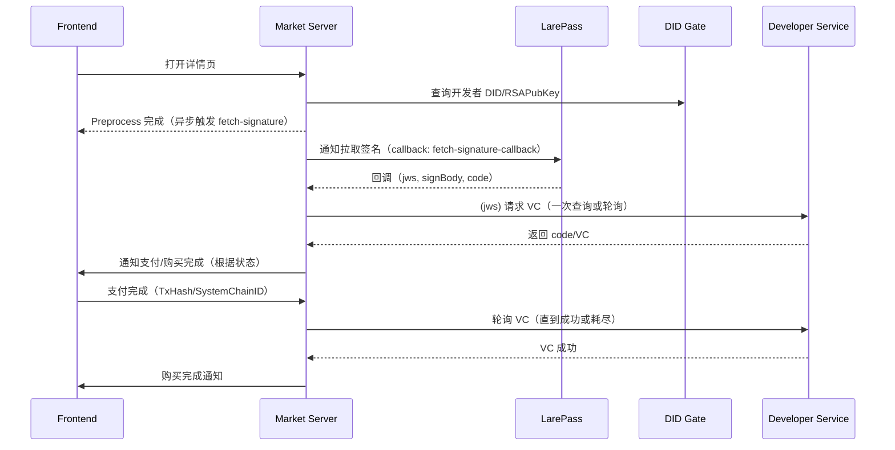

## 概览

**目标**: 以“支付状态机”统一管理应用购买流程的全生命周期（开发者信息准备 → LarePass 签名 → 前端支付 → 开发者确认 VC → 凭据持久化 → 前端通知）。

**状态来源与存储**:
- **内存**: `PaymentStateMachine.states`（运行期状态）、`paymentStateStore`（工具层缓存）。
- **Redis**: 状态 `payment:state:{userID}:{appID}:{productID}`，购买凭据 `payment:receipt:{userID}:{developerName}:{appID}:{productID}`。

**外部系统**:
- DID Gate（查询开发者 `DID/RSAPubKey`）。
- LarePass（签名发起与签名拉取回调）。
- 开发者服务 `AuthService/ActivateAndGrant`（基于 JWS 返回 VC）。
- 前端系统（系统级通知：支付所需数据、购买完成）。


## 状态与数据结构

### 五维状态
- **PaymentNeed**: `not_required` | `required` | `error_missing_developer` | `error_developer_fetch_failed`
- **DeveloperSync**: `not_started` | `in_progress` | `completed` | `failed`
- **LarePassSync**: `not_started` | `in_progress` | `completed` | `failed`
- **SignatureStatus**: `not_evaluated` | `not_required` | `required` | `required_and_signed` | `required_but_pending` | `error_no_record` | `error_need_resign`
- **PaymentStatus**: `not_evaluated` | `not_notified` | `notification_sent` | `frontend_completed` | `developer_confirmed`

### PaymentState（运行期主状态）
- 基础标识: `UserID`、`AppID`、`AppName`、`SourceID`、`ProductID`、`DeveloperName`
- 开发者信息: `Developer{Name,DID,RSAPubKey}`
- 五维状态: `PaymentNeed`、`DeveloperSync`、`LarePassSync`、`SignatureStatus`、`PaymentStatus`
- 关联数据: `JWS`、`SignBody`、`VC`、`TxHash`、`SystemChainID`、`XForwardedHost`
- 元数据: `CreatedAt`、`UpdatedAt`
- 方法: `GetKey()`（唯一键：`user:app:product`）、`IsFinalState()`（是否终态）

### PaymentStateMachine（状态机）
- 内存表: `states map[string]*PaymentState` + `RWMutex`
- 依赖: `dataSender`（对外通知）、`settingsManager`（Redis 与系统配置）
- 关键方法（内部）:
  - 读写: `getState`、`setState`、`updateState`
  - 事件: `processEvent`（分发给各 `handle*`）
  - 同步: `processFetchSignatureCallback`、`triggerVCSync`、`requestVCFromDeveloper`、`pollForVCFromDeveloper`
  - 维护: `findStateByUserAndProduct`、`cleanupCompletedStates`、`storePurchaseInfo`

## 事件与流程

- `start_payment`: 设为需要支付（占位，后续可按业务自动判断是否需签名与通知）。
- `request_signature`: 置 `SignatureRequired`，若具备 `XForwardedHost` 则通知 LarePass 发起签名。
- `signature_submitted`: 写入 `JWS/SignBody`，置 `LarePassSyncCompleted`、`SignatureRequiredAndSigned`，异步向开发者请求 VC。
- `payment_completed`: 写入 `TxHash/SystemChainID`，置 `PaymentFrontendCompleted`，开始轮询开发者 VC。
- `vc_received`: 写入 `VC`，置 `DeveloperSyncCompleted`、`PaymentDeveloperConfirmed`，持久化购买凭据并通知前端购买完成。

辅助推进：
- `triggerPaymentStateSync(state)`: 基于 `LarePassSync` 推进（首次/进行中催发 fetch-signature；完成则 `triggerVCSync`）。
- `processFetchSignatureCallback(jws, signBody, user, code)`: 解析 `productId` 定位状态；`code==0` 写入 `JWS` 并推进 `triggerVCSync`。

典型时序：预处理 → 拉取签名 → 提交签名 → 前端支付 → 开发者确认 VC → 落库通知。

## 外部交互与回调

- DID Gate：`GET {SystemRemoteService}/did/domain/faster_search/{did}` → `Name/DID/RSAPubKey`。
- 开发者服务：`POST https://4c94e3111.{developerName}/api/grpc/AuthService/ActivateAndGrant`，Body: `{jws}` → 返回 `code/VC`。
- LarePass 通知：
  - 发起签名（含可选 `application_verifiable_credential`）：Topic `market_payment`；回调 `submit-signature`。
  - 拉取签名（无 `txHash`）：Topic `fetch_payment_signature`；回调 `fetch-signature-callback`。
- 回调地址：
  - `https://{X-Forwarded-Host}/app-store/api/v2/payment/submit-signature`
  - `https://{X-Forwarded-Host}/app-store/api/v2/payment/fetch-signature-callback`

## API 用法（对外）

- 初始化：`InitStateMachine(dataSender, settingsManager)`
- 预处理：`PreprocessAppPaymentData(ctx, appInfo, userID, sourceID, settingsManager, client)`
- 查询：`GetPaymentStatus(userID, appID, sourceID, appInfo)`
- 推进购买：`PurchaseApp(userID, appID, sourceID, xForwardedHost, appInfo)`
- 支付完成轮询：`StartPaymentPolling(userID, sourceID, appID, txHash, xForwardedHost, systemChainID, appInfoLatest)`
- 签名回调：
  - 提交签名：`ProcessSignatureSubmission(jws, signBody, user, xForwardedHost)`
  - 拉取签名：`HandleFetchSignatureCallback(jws, signBody, user, code)`
- 调试：`ListPaymentStates()`

返回语义（示例）：
- `PurchaseApp` 可能返回：`signature_required` / `payment_required` / `waiting_developer_confirmation` / `purchased` / `syncing`。

## 存储与键规范

- 状态：`payment:state:{userID}:{appID}:{productID}`（JSON: `PaymentState`）。
- 凭据：`payment:receipt:{userID}:{developerName}:{appID}:{productID}`（JSON: `PurchaseInfo{VC,Status}`）。
- 内存缓存：`PaymentStateMachine.states` 与 `paymentStateStore.states`（后续可合并统一）。

## 并发与可重入

- 状态更新采用拷贝-更新-覆盖并加锁；异步落 Redis，避免阻塞。
- 轮询含防重入检查：`DeveloperSyncInProgress` 时跳过重复启动。
- `triggerPaymentStateSync`/回调处理均可重入，网络波动不会卡死流程。

## 错误与边界

- 缺 `productID`：视为免费或跳过处理；部分接口要求“预处理已运行”。
- 缺开发者 DID 或 DID 查询失败：构造失败态（`error_missing_developer`/`error_developer_fetch_failed`）并持久化。
- 缺 `X-Forwarded-Host`：拒绝发起签名通知（无法构造回调 URL）。
- 开发者服务非 2xx/网络错误：在轮询内重试，最终落 `DeveloperSyncFailed`。
- `getUserDID` 要求 `X-Forwarded-Host` 至少三段域名。

## 可改进建议

- 完成 `handleStartPayment` 业务分支与 `CanTransition` 守卫规则。
- 完善 `buildPaymentStatusFromState` 的用户态映射与错误态文案。
- 合并双层内存缓存，统一经由状态机读写以消除不一致。
- 补全 `verifyVCAgainstManifest` 的 JSONPath 校验逻辑与签名有效性验证。
- 增加退避重试、阶段超时与清理策略的配置化支持。

## 前端可见状态映射（建议）

- `developer_confirmed` → 已购买（可安装）
- `frontend_completed` → 已支付，等待开发者确认
- `notification_sent` → 已通知前端进行支付
- `not_notified` / `not_evaluated` → 未开始/未评估（可触发 `PurchaseApp` 推进）
- 错误类（`error_*`）→ 引导用户重试或联系支持

## 回调载荷与参数要点

- submit-signature 回调：`ProcessSignatureSubmission(jws, signBody, user, xForwardedHost)`
  - `signBody` 需包含 `application_verifiable_credential.productId` 或 `vc.credentialSubject.productId`
  - 从 `signBody` 解析 `productId` 定位状态

- fetch-signature 回调：`HandleFetchSignatureCallback(jws, signBody, user, code)`
  - `code==0` 代表签名成功，将写入 `JWS` 并推进 VC 同步

## 前端支付数据（示例）

返回字段 `payment_data`（`notifyFrontendPaymentRequired`）：

```json
{
  "from": "did:user",
  "to": "did:developer",
  "product": [{ "product_id": "xxx" }]
}
```

## 故障排查 Checklist

- 没有状态或提示“ensure preprocessing ran”：确保调用了 `PreprocessAppPaymentData`。
- 无法发起签名：检查 `X-Forwarded-Host` 是否传入且为至少三段域名。
- DID 查询失败：检查 SystemRemoteService 配置与网络联通。
- 开发者 VC 获取失败：查看 `queryVCFromDeveloper` 日志与开发者服务返回 `code`。
- 轮询不生效：确认未被判定为“已在进行中”，以及状态 `PaymentFrontendCompleted` 是否已写入。

## 时序图（概览）



## 状态转移表（简化）

- `SignatureRequired` + submit-signature → `SignatureRequiredAndSigned`
- `SignatureRequiredAndSigned` + vc(code=0) → `SignatureNotRequired` + `DeveloperSyncCompleted`
- `PaymentFrontendCompleted` + vc(code=0) → `PaymentDeveloperConfirmed`
- vc(code=1) → `SignatureErrorNoRecord`（可提示重试）
- vc(code=2) → `SignatureErrorNeedReSign`（提示重新签名）
- 轮询失败/网络错误 → `DeveloperSyncFailed`

## 配置与依赖

- SystemRemoteService：提供 DID Gate 访问的基础 URL（由 `settings` 组件缓存）。
- Redis：读写 `payment:state:*`、`payment:receipt:*` 键。
- X-Forwarded-Host：必需，用于构造回调 URL 和解析用户 DID（需至少三段域名）。

## 日志与监控

- 关键日志点：
  - `queryVCFromDeveloper` 请求与响应码
  - 各事件处理 `processEvent/handle*` 的“Before/After 状态”
  - 轮询起止、尝试次数与最终结果
  - Redis 读写失败与降级分支
- 建议埋点：
  - 事件吞吐与失败率（按 code 分类）
  - 平均等待 VC 的时长（支付完成→开发者确认）

## FAQ / 最佳实践

- Q: 为什么有时 `GetPaymentStatus` 返回 `not_evaluated`？
  - A: 尚未运行预处理或首次同步未完成；先调用 `PreprocessAppPaymentData`。
- Q: 提交签名后没有收到支付提示？
  - A: 检查 `ProcessSignatureSubmission` 是否被正确回调；并确认 `notifyFrontendPaymentRequired` 通道畅通。
- Q: 轮询耗时过长？
  - A: 调整轮询次数/间隔（当前 20 次/30s），或在开发者侧提供推送回调能力。


