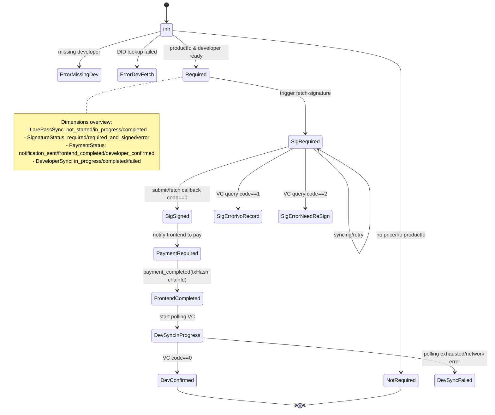

## Overview

**Goal**: Use a "payment state machine" to manage the full lifecycle of an app purchase (developer info preparation → LarePass signature → frontend payment → developer VC confirmation → receipt persistence → frontend notification).

**State sources and storage**:
- **In-memory**: `PaymentStateMachine.states` (runtime state), `paymentStateStore` (tool-layer cache).
- **Redis**: state `payment:state:{userID}:{appID}:{productID}`, purchase receipt `payment:receipt:{userID}:{developerName}:{appID}:{productID}`.

**External systems**:
- DID Gate (query developer `DID/RSAPubKey`).
- LarePass (signature initiation and fetch-signature callbacks).
- Developer service `AuthService/ActivateAndGrant` (returns VC based on JWS).
- Frontend system (system notifications: payment data, purchase completion).


## States and data structures

### Five-dimensional states
- **PaymentNeed**: `not_required` | `required` | `error_missing_developer` | `error_developer_fetch_failed`
- **DeveloperSync**: `not_started` | `in_progress` | `completed` | `failed`
- **LarePassSync**: `not_started` | `in_progress` | `completed` | `failed`
- **SignatureStatus**: `not_evaluated` | `not_required` | `required` | `required_and_signed` | `required_but_pending` | `error_no_record` | `error_need_resign`
- **PaymentStatus**: `not_evaluated` | `not_notified` | `notification_sent` | `frontend_completed` | `developer_confirmed`

### PaymentState (runtime primary state)
- Identifiers: `UserID`, `AppID`, `AppName`, `SourceID`, `ProductID`, `DeveloperName`
- Developer info: `Developer{Name,DID,RSAPubKey}`
- Five-dimensional states: `PaymentNeed`, `DeveloperSync`, `LarePassSync`, `SignatureStatus`, `PaymentStatus`
- Associated data: `JWS`, `SignBody`, `VC`, `TxHash`, `SystemChainID`, `XForwardedHost`
- Metadata: `CreatedAt`, `UpdatedAt`
- Methods: `GetKey()` (unique key: `user:app:product`), `IsFinalState()` (whether final)

### PaymentStateMachine (state machine)
- In-memory table: `states map[string]*PaymentState` + `RWMutex`
- Dependencies: `dataSender` (external notifications), `settingsManager` (Redis and system config)
- Key methods (internal):
  - R/W: `getState`, `setState`, `updateState`
  - Events: `processEvent` (dispatches to `handle*`)
  - Sync: `processFetchSignatureCallback`, `triggerVCSync`, `requestVCFromDeveloper`, `pollForVCFromDeveloper`
  - Maintenance: `findStateByUserAndProduct`, `cleanupCompletedStates`, `storePurchaseInfo`

## Events and flows

- `start_payment`: mark as payment required (placeholder; business logic may auto-decide signature and notification later).
- `request_signature`: set `SignatureRequired`; if `XForwardedHost` is present, notify LarePass to initiate signing.
- `signature_submitted`: write `JWS/SignBody`, set `LarePassSyncCompleted` and `SignatureRequiredAndSigned`, asynchronously request VC from developer.
- `payment_completed`: write `TxHash/SystemChainID`, set `PaymentFrontendCompleted`, start polling developer for VC.
- `vc_received`: write `VC`, set `DeveloperSyncCompleted` and `PaymentDeveloperConfirmed`, persist purchase receipt and notify frontend of completion.

Auxiliary progression:
- `triggerPaymentStateSync(state)`: progress based on `LarePassSync` (kick off fetch-signature on first/in-progress; on completed, call `triggerVCSync`).
- `processFetchSignatureCallback(jws, signBody, user, code)`: parse `productId` to locate state; when `code==0`, write `JWS` and proceed with `triggerVCSync`.

Typical sequence: preprocessing → fetch signature → submit signature → frontend payment → developer VC confirmation → persist and notify.

## External interactions and callbacks

- DID Gate: `GET {SystemRemoteService}/did/domain/faster_search/{did}` → `Name/DID/RSAPubKey`.
- Developer service: `POST https://4c94e3111.{developerName}/api/grpc/AuthService/ActivateAndGrant`, Body: `{jws}` → returns `code/VC`.
- LarePass notifications:
  - Initiate signature (optional `application_verifiable_credential`): Topic `market_payment`; callback `submit-signature`.
  - Fetch signature (no `txHash`): Topic `fetch_payment_signature`; callback `fetch-signature-callback`.
- Callback URLs:
  - `https://{X-Forwarded-Host}/app-store/api/v2/payment/submit-signature`
  - `https://{X-Forwarded-Host}/app-store/api/v2/payment/fetch-signature-callback`
  - Strong dependency (current version): The above callback URLs rely on `X-Forwarded-Host`; if missing/invalid, the flow will fail

## API usage (public)

- Initialize: `InitStateMachine(dataSender, settingsManager)`
- Preprocess: `PreprocessAppPaymentData(ctx, appInfo, userID, sourceID, settingsManager, client)`
- Query: `GetPaymentStatus(userID, appID, sourceID, appInfo)`
- Advance purchase: `PurchaseApp(userID, appID, sourceID, xForwardedHost, appInfo)`
- Poll after payment completion: `StartPaymentPolling(userID, sourceID, appID, txHash, xForwardedHost, systemChainID, appInfoLatest)`
- Signature callbacks:
  - Submit signature: `ProcessSignatureSubmission(jws, signBody, user, xForwardedHost)`
  - Fetch signature: `HandleFetchSignatureCallback(jws, signBody, user, code)`
- Debugging: `ListPaymentStates()`

返回语义（示例）：
- `PurchaseApp` 可能返回：`signature_required` / `payment_required` / `waiting_developer_confirmation` / `purchased` / `syncing`。

## Storage and key conventions

- State: `payment:state:{userID}:{appID}:{productID}` (JSON: `PaymentState`).
- Receipt: `payment:receipt:{userID}:{developerName}:{appID}:{productID}` (JSON: `PurchaseInfo{VC,Status}`).
- In-memory cache: `PaymentStateMachine.states` and `paymentStateStore.states` (can be unified later).

## Access and rules

- Unified access: read/write state only via `PaymentStateMachine` wrapper.
  - Read: `LoadState(userID, appID, productID)` (miss in memory → load from Redis and write back to memory)
  - Write: `SaveState(state)` (write to Redis and sync memory)
  - Delete: `DeleteState(userID, appID, productID)` (delete from Redis and sync memory)
- Do not access Redis directly or bypass the state machine to avoid inconsistency and missing notifications under concurrency.

## Concurrency and reentrancy

- State updates use copy-update-replace with locks; Redis writes are async to avoid blocking.
- Polling includes reentrancy guard: skip if `DeveloperSyncInProgress`.
- `triggerPaymentStateSync` and callbacks are reentrant; network issues won't deadlock the flow.

## Errors and boundaries

- Missing `productID`: treated as free or skipped; some APIs require preprocessing to have run.
- Missing developer DID or DID lookup failure: build failure states (`error_missing_developer`/`error_developer_fetch_failed`) and persist.
- Missing `X-Forwarded-Host`: refuse to initiate signature (cannot build callback URL). This is a hard dependency in current version.
- Developer service non-2xx/network errors: retry during polling; eventually set `DeveloperSyncFailed`.
- `getUserDID` requires `X-Forwarded-Host` to have at least three domain parts.

## Improvements

- Complete `handleStartPayment` business branches and `CanTransition` guard rules.
- Improve user-facing mapping and error texts in `buildPaymentStatusFromState`.
- Merge dual in-memory caches; unify read/write via the state machine to remove inconsistencies.
- Implement JSONPath checks and signature validation in `verifyVCAgainstManifest`.
- Add configurable backoff, phase timeouts, and cleanup strategies.

## Frontend-visible status mapping (suggested)

- `developer_confirmed` → Purchased (installable)
- `frontend_completed` → Paid, waiting for developer confirmation
- `notification_sent` → Frontend has been notified to pay
- `not_notified` / `not_evaluated` → Not started/Not evaluated (can trigger `PurchaseApp`)
- Error class (`error_*`) → Guide user to retry or contact support

## Callback payloads and parameters

- submit-signature callback: `ProcessSignatureSubmission(jws, signBody, user, xForwardedHost)`
  - `signBody` must include `application_verifiable_credential.productId` or `vc.credentialSubject.productId`
  - Parse `productId` from `signBody` to locate state

- fetch-signature callback: `HandleFetchSignatureCallback(jws, signBody, user, code)`
  - `code==0` means signature succeeded; will write `JWS` and proceed with VC sync

## Frontend payment data (example)

Returned field `payment_data` (`notifyFrontendPaymentRequired`):

```json
{
  "from": "did:user",
  "to": "did:developer",
  "product": [{ "product_id": "xxx" }]
}
```

## Troubleshooting checklist

- No state or message "ensure preprocessing ran": ensure `PreprocessAppPaymentData` is called.
- Cannot initiate signature: check `X-Forwarded-Host` is provided and has at least three domain parts.
- DID lookup failed: check SystemRemoteService configuration and network reachability.
- Developer VC fetch failed: check `queryVCFromDeveloper` logs and the `code` returned by developer service.
- Polling ineffective: ensure not considered "in progress" and `PaymentFrontendCompleted` has been written.

## State machine diagram (core)



The diagram focuses on state-machine transitions; an E2E sequence diagram can be added in an appendix if needed.

## State transition table (simplified)

- `SignatureRequired` + submit-signature → `SignatureRequiredAndSigned`
- `SignatureRequiredAndSigned` + vc(code=0) → `SignatureNotRequired` + `DeveloperSyncCompleted`
- `PaymentFrontendCompleted` + vc(code=0) → `PaymentDeveloperConfirmed`
- vc(code=1) → `SignatureErrorNoRecord` (suggest retry)
- vc(code=2) → `SignatureErrorNeedReSign` (suggest re-sign)
- Polling failure/network error → `DeveloperSyncFailed`

## Configuration and dependencies

- SystemRemoteService: base URL for DID Gate access (cached by `settings`).
- Redis: read/write `payment:state:*` and `payment:receipt:*` keys.
- X-Forwarded-Host: required to build callback URLs and derive user DID (needs at least three domain parts).


